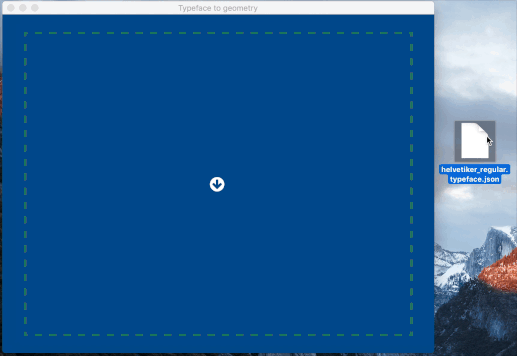

# Typeface to Geometry

   

A simple tool to preview and export THREE.js fonts to geometry ready to use in 3D applications.

Example Android app and font loading classes coming soon.

## Binaries and installers

Coming soon!

## Build and run

If you don't use [nvm](https://github.com/creationix/nvm), you really really should (even on [Windows](https://github.com/coreybutler/nvm-windows)).

Make sure you're running node 6.9.1:

`nvm install 6.9.1 && nvm use 6.9.1`

Install dependencies:

`npm install`

Once that is done, you can launch it with:

`npm start`

## Credits

This project was made using awesome opens source libraries, including [React](https://github.com/facebook/react), [Redux](https://github.com/reactjs/redux), [THREE.js](https://github.com/reactjs/redux) (with [react-three-renderer](https://github.com/toxicFork/react-three-renderer) and it's [trackball controls](https://github.com/toxicFork/react-three-renderer-example/blob/a041d1c7291da717968cf7768c2ed493bfe13dce/src/ref/trackball.js)) and Github's [electron-compile](https://github.com/electron/electron-compile).

Check out the package.json file to learn more about them.
